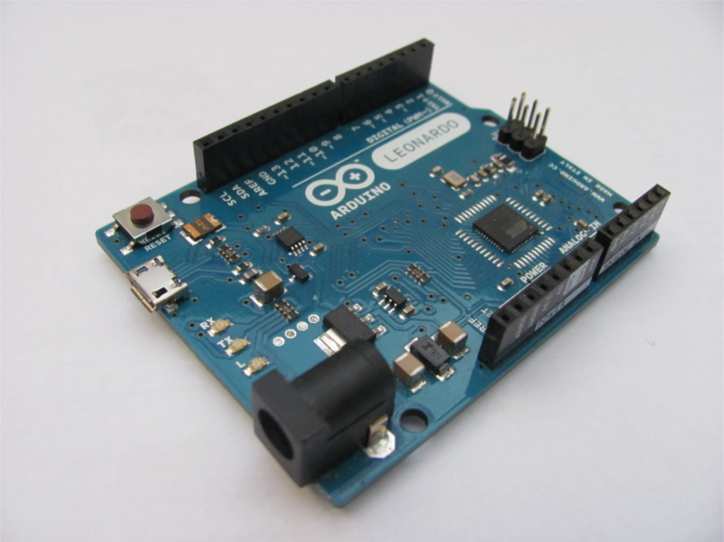
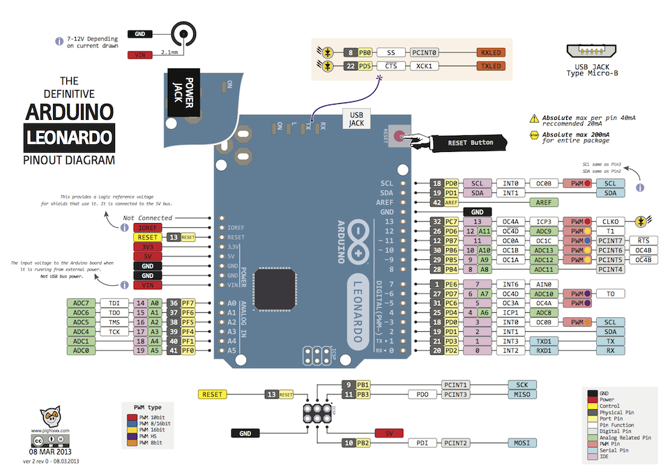

..  _kap-arduino:

*******************
Arduino
*******************

.. |_| unicode:: 0xA0
   :trim:

:index:`Arduino` jsem zvolil díky velkému množství rozšířujících desek, které jsem použil. Také z důvodu využití open source [#p2]_ licence pro software a hardware. Arduino má veřejné zdrojové kódy a schémata a každý je může upravit jak sám potřebuje. Také díky tomu se Arduino rychle rozšířilo po celém světě, je pro něj k dispozici velké množství dokumentace a |_| příkladů použití.

Dle :cite:`2014:voda` začal vývoj prvního Arduina v roce 2005, když se lidé z italské firmy Interaction Design Institute Ivrea rozhodli vytvořit jednoduchý a levný vývojový kit pro studenty, kteří neměli možnost si pořídit drahé kity jiných výrobců. Arduino se mezi studenty uchytilo a tak se tvůrci rozhodli poskytnout Arduino celému světu.

Řídicí jednotkou autonomního pásového vozidla je Arduino Leonardo s mikrokontrolérem ATmega32U4 firmy Atmel (viz. :num:`obr. #obr-arduino`). Leonardo samotné neobsahuje pouze procesor, ale i |_| řadu dalších podpůrných obvodů např.: převodník z USB na rozhraní RS232 v napěťových úrovních 5 |_| V a  obvod pro stabilizaci napětí. 

..  _obr-arduino:

    
    Arduino Leonardo

Leonardo má vstupy a výstupy dostupné na dutinkových lištách po obvodu (viz. :num:`obr. #obr-tumblr`). Na Leonardu je také resetovací tlačítko, několik signalizačních LED diod: pro signalizaci připojeného napájecího napětí a pro signalizaci komunikace po sériové lince. Leonardo poskytuje celkem 14 digitálních pinů a 6 pinů analogových. Šest z digitálních pinů lze také použít na hardwarové PWM [#p1]_. 

..  _obr-tumblr:

    
    Zapojení vstupů a výstupů desky Arduino Leonardo :cite:`Tumblr`

:index:`Arduino Leonardo` lze napájet napětím od 6 |_| V do 20 |_| V, ale doporučené napájecí napětí je od 7 |_| V do 12 |_| V. Arduino lze napájet pomocí Micro USB, nebo pomocí Power Jack konektoru. 

..  [#p1]  Pulzně šířková modulace
..  [#p2]  Veřejné zdrojové kódy i schémata
