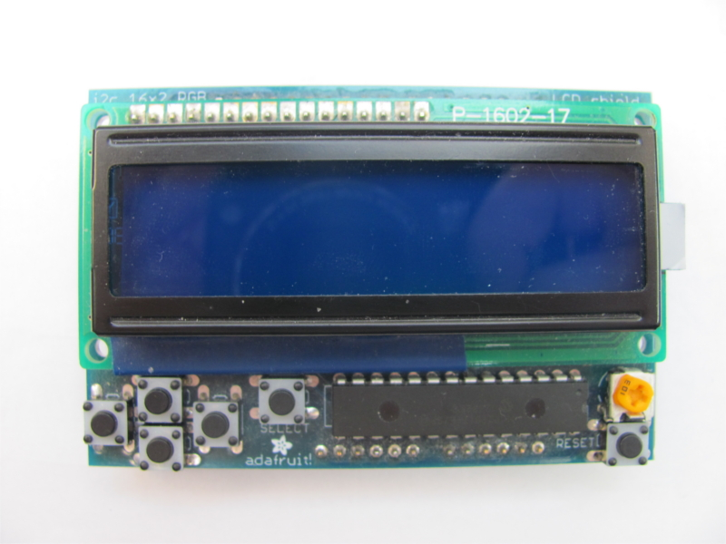

*******************
LCD
*******************

Pokud potředujete ovládat LCD [#p1]_ 16x2 je většinou potřeba 6 výstupů na ovládání LCD a potom další 3 pro ovládání RGB [#p2]_. To je celkem 9 výstupů + napájení a zem, což je takřka polovina výstupů, které má k dispozici Arduino Leonardo.

Tohoto jsem se chtěl vyvarovat, protože bych potom neměl dostatek výstupů na ovládání motorů a připojení senzorů. Z tohoto důvodu jsem zvolil LCD desku od Adafruit (viz. :num:`obr. #obr-lcd`). Tato usnadňuje použití LCD 16x2. Díky LCD desce stačí pouze dva výstupy místo zmiňovaných devíti. To umožňuje komunikace přes standartní I2C sběrnici.

..  _obr-lcd:

    
    LCD shield od Adafruit

..  [#p1]  Liquid crystal display
..  [#p2]  Barevný model red-green-blue
