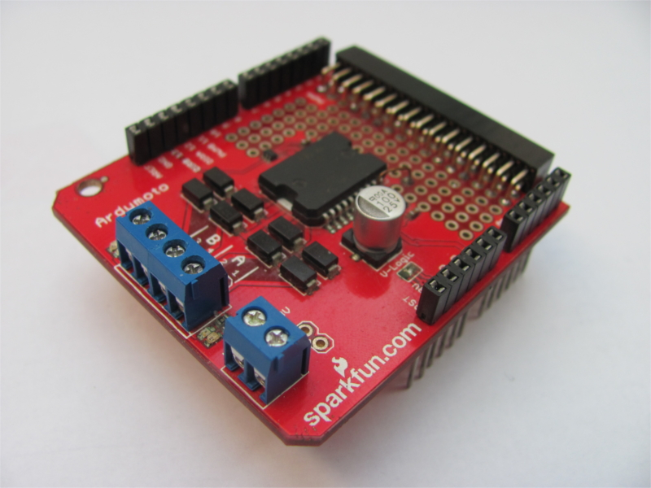

*******************
Ardumoto
*******************

.. |_| unicode:: 0xA0
   :trim:

Jedná se o desku od firmy Sparkfun určenou pro  Arduino k řízení motorů (viz. :num:`obr. #obr-ardumoto`). Tato deska dokáže řídit dva DC motory. Jádrem desky je dvoukanálový motorový driver L298P, díky tomu můžeme do každého kanálu (motoru) dodat až 2 |_| A. Deska obsahuje dva páry LED (žlutá a modrá), které slouží na indikaci směru.

Deska umožňuje napájení buď z 3,3 |_| V nebo z 5 |_| V logiky. Ovládání směru motorů je připojeno na digitální výstupy 12 a 13. Ovládání rychlosti je na výstupech 3 a 11 (PWM).

..  _obr-ardumoto:

    
    ArduMoto

