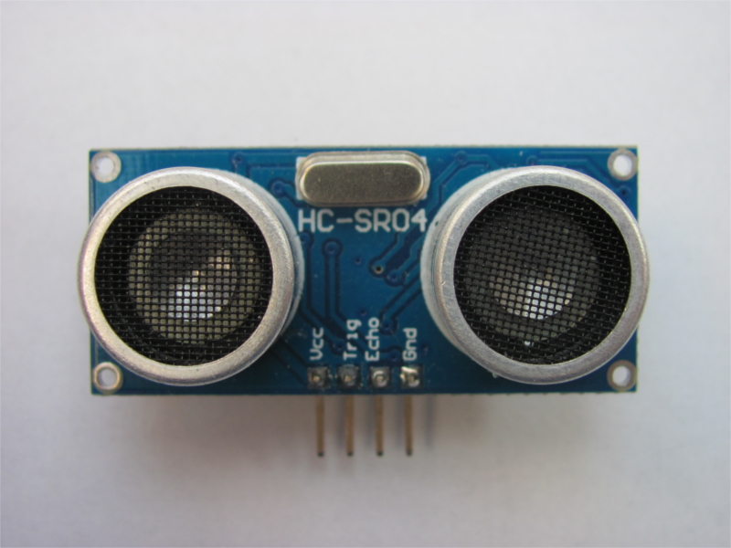

..  _kap-senzor: 

*******************
Senzor
*******************

.. |_| unicode:: 0xA0
   :trim:

Senzor :index:`HC-SR04` je ultrazvukový senzor určený k měření vzdálenosti. Senzor vyvolá vysokofrekvenční zvukové vlny a zachytává jejich odraz. Z časového intervalu mezi vyvoláním a |_| přijmutím vln se za pomocí vzorce se vypočítá vzdálenost. 

..  math:: s = \frac{t}{58}

Ve výše uvedeném vzorci je `s` měřená vzdálenost a `t` doba odezvy na vyslaný ultrazvukový signál. Senzor HC-SR04 dokáže změřit vzdálenost od 3 |_| cm do 400 |_| cm. Senzor vysílá ultrazvukové vlny o frekvenci 40 |_| Hz s rozptylem 15°. Senzor je napájen 5 |_| V a jeho odběr je 15 |_| mA. Příklad ovládání senzoru je popsán v :cite:`Arduinousenzor`.

    
    HC-SR04 

