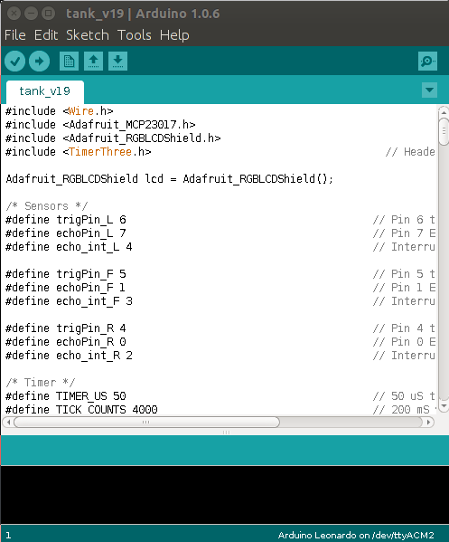

*******************
Arduino IDE
*******************

.. |_| unicode:: 0xA0
   :trim:

Arduino má svoje vlastní vývojové prostředí tzv. IDE. Toto prostředí je naprogramované v |_| jazyce Java. Toto prostředí podporuje programovací jazyk Wiring.

Arduino IDE je dostupné pro operační systémy Linux, OSX a Windows. Arduino IDE slouží k |_| programování a nahrávání programu do vývojových desek Arduino. Arduino a jeho vývojové prostředí popisuje :cite:`2014:voda`. 

    
    Arduino IDE 1.0.6 v Ubuntu 14.04

