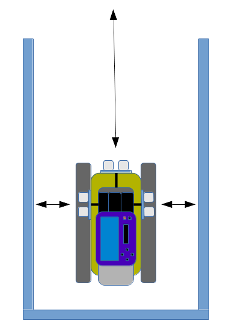
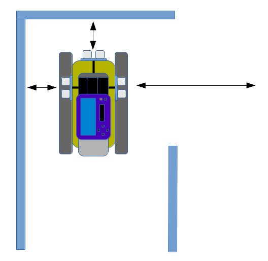
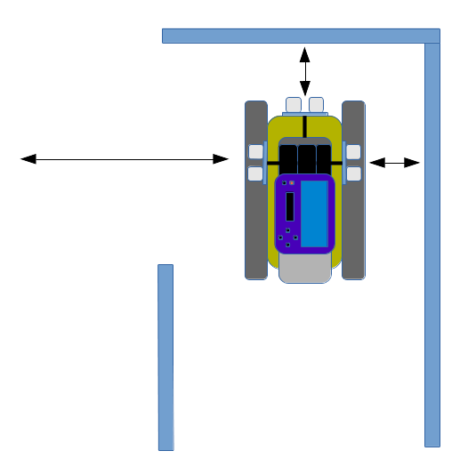
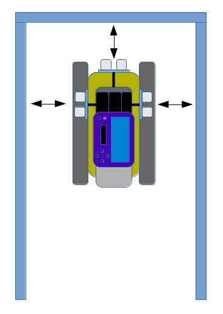

..  _kap-regulace:

*******************
Řízení
*******************

.. |_| unicode:: 0xA0
   :trim:

Řízení je činnost, kterou může provádět automatický regulátor. Regulátor má za úkol podle hodnoty na vstupu udržovat hodnotu regulované veličiny (teploty, hladiny, rychlosti, atd.).

V případě mého pásového vozidla je nutno toto aplikovat na bludiště. Bludiště má pouze jeden začátek a jeden konec a pouze pravoúhlé zatáčky. To znamená, že v bludišti mohu nastat pouze 4 situace:

* Jízda vpřed
* Otočení doleva
* Otočení doprava
* Zastavení 
 
Po startu je důležité udržovat pásové vozidlo ve středu bludiště, nebo v konstantní vzdálenosti od stěny (viz :num:`obr. #obr-dopredu`). Toto má na starosti regulátor přímé jízdy. Je to velice důležité, aby nedošlo ke kolizi se stěnou bludiště. Je to potřeba také proto, že nic není dokonalé ani motory a vozidlo nemusí jezdit přímočaře. Také je tím ošetřeno špatné nastavení vozidla před startem.

..  _obr-dopredu:

    
    Dopředu

Po startu se vozidlo dříve nebo později dostane do situace, kdy už nebude moci jet rovně. V |_| takovéto situaci musí zjistit, jaké má možnosti. Vyhodnotit ji může například tak, že na některé ze stran má dostatek místa k dalšímu postupu a další pohyb bude směřovat tím směrem (viz :num:`obr. #obr-doprava` nebo viz :num:`obr. #obr-doprava`). Po zjištění vzdálenosti a vyhodnocení se vozidlo otočí daným směrem o |_| 90°. 

..  _obr-doprava:

    
    Doprava

..  _obr-doleva:

    
    Doleva

Po otočení přebírá opět řízení regulátor přímé jízdy, který se opět snaží udržet vozidlo uprostřed bludiště. Tento proces se může neustále opakovat. Změna nastane v okamžiku, kdy už vozidlo nebude mít dostatek prostoru k pokračování v jízdě (viz :num:`obr. #obr-stop`). To znamená, že vozidlo je na konci bludiště a zastaví.

..  _obr-stop:

    
    Stop

Regulátor přímé jízdy reguluje rychlost otáček motorů na základě hodnot získaných ze senzorů. Regulátor je nastaven tak, že se snaží APV udržet uprostřed bludiště. Podle toho, na jakou stranu se reguluje, tak z té strany se odečítají hodnoty senzoru. Hodnoty senzorů se pro větší přesnost filtrují, aby se odstranily nežádoucí hodnoty. Výsledný rozdíl vzdálenosti se K-krát zvětší a |_| přičte se k |_| rychlosti daného motoru. 

Velice důležité je znát také úhel natočení vůči straně, podle které regulátor reguluje (viz :ref:`kap-rozbor`). Díky tomu regulátor dokáže rychleji reagovat na vychýlení se ze středu bludiště.
