..  _kap-konstrukce:

*******************
Konstrukce
*******************

.. |_| unicode:: 0xA0
   :trim:

Konstruování je jedna z nejdůležitějších činností na většině projektů. Konstrukci pásového vozidla jsem přepracovával několikrát, většinou kvůli nevyhovujícímu umístění. Základem celé konstrukce Autonomního pásového vozidla je univerzální plastové pole 31x11 otvorů podobné stavebnici :index:`Merkur`. K této základně je připevněno 5 os, z nichž je 6 hladkých a jedna hnací šestihranná. Všech pět os je připevněno plastovými díly z Universal plate set od firmy Tamiya, inc. Na koncích každé osy jsou dvě plastová kola určená k vedení a držení pásu a na koncích šestihranné osy jsou ozubená hnací kola určená k převodu otáček převodovky na pásy.

Na jeden okraj tohoto plastového skeletu je pomocí dvou šroubků připevněna převodovka Twin-motor gearbox také od firmy Tamiya, inc (viz :num:`obr. #obr-prevodovka`). Tato převodovka převádí točivý moment dvou DC motorů pomocí dvou navzájem oddělených soustav ozubených kol a hřídele do pásů. Převodovka umožňuje převod na tři rychlosti označenými písmeny A-C od nejrychlejšího převodu po nejpomalejší. Pro pohon pásového vozidla není ani tak potřeba rychlost, jako síla. Proto využívám třetí převod C.

..  _obr-prevodovka:

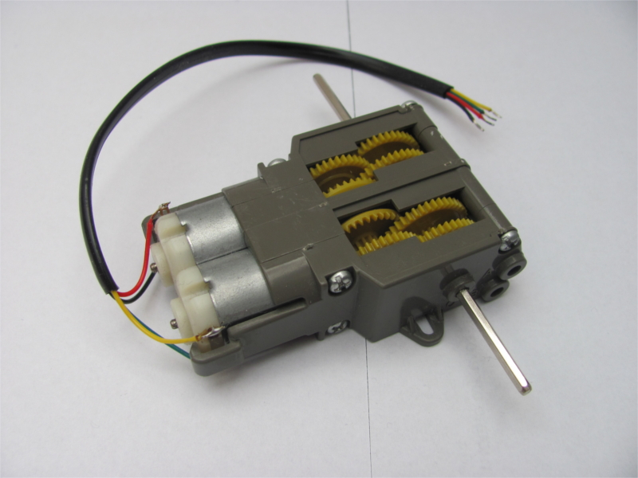
    
    Převodovka Twin-motor gearbox

Nad převodovkou je za pomoci dílů stavebnice Merkur vytvořena plošina pro Arduino (viz :num:`obr. #obr-skelet`). Stavebnice Merkur a Tamiya jsou velice podobné. Hlavním rozdílem je hmotnost jednotlivých dílů stavebnice. Toto je kvůli tomu, že Merkur je kovový oproti Tamiyi. Důležité je ovšem to, že obě stavebnice mají stejnou rozteč otvorů pro šroubky i když jinou hustotou dírek. Nahoru na plošinu je za pomoci oboustranné lepící pásky připevněna pěnová podložka, která má dvě funkce. První, izolovat Arduino od kovové konstrukce aby nedošlo ke zkratování vývodů na spodní části Arduina. Druhá, zafixovat Arduino, aby se při jízdě a nárazech nepohybovalo.   

..  _obr-skelet:

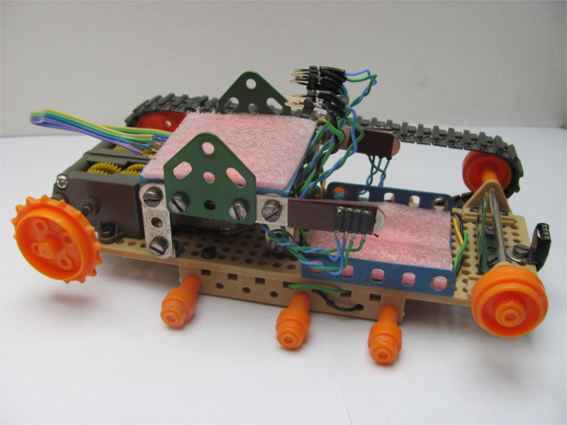
    
    Skelet APV

V přední části plastového skeletu je upevnění napájení pásového vozidla opět za pomoci stavebnice Merkur. Na povrchu je opět pěnová podložka jako izolace a tlumič nárazů. Napájení je tvořeno plastovou klecí 3x2 na články velikosti AA (viz :num:`obr. #obr-napajeni`). Výhodnější je využít nabíjecí akumulátory z důvodů časté výměny. Nabíjecí akumulátory mají napětí 1,2 |_| V. Celé autonomní vozidlo je tedy napájeno 7,2 |_| V DC [#p2]_. Napájení je přivedeno do Arduina pomocí bílé dvoulinky zakončené souosým konektorem. Vodič s kladnou polaritou jsem přerušil a propojil pomocí klasického dvoupolohového vypínače. Je to kvůli častému odpojování a připojování napájení aby se neničil konektor Arduina a z důvodu snazšího vypnutí a zapnutí.

..  _obr_napajeni:

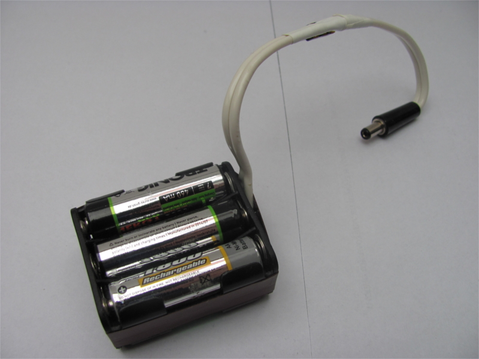
    
    Napájení APV

Další důležitá věc je, kde a jak upevnit ultrazvukové senzory HC-SR04. Senzory musí být umístěny tak, aby se ultrazvuková vlna neodrazila od konstrukce APV. Na orientaci v prostoru jsou zapotřebí minimálně tři senzory, z nichž jeden vepředu a dva na stranách. Přední senzor je umístěn doprostřed přední části skeletu na dílu opět ze stavebnice Merkur. Na tento díl je připevněna dutinková lišta, do které se dá jednoduše zasunout senzor. Zbylé dva jsou připevněny na kovové konstrukci držící Arduino, každý jedné straně. Stejně jako přední senzor tak i postranní senzory se zasouvají do dutinkové lišty. Postranní senzory jsou umístěny tak, že vysílač a přijímač ultrazvuku jsou zarovnány rovnoběžně s pásy. Díky tomu se vlny neodráží od pásu a zároveň při pohybu blízko překážky nehrozí poškození ani ulomení senzoru. 

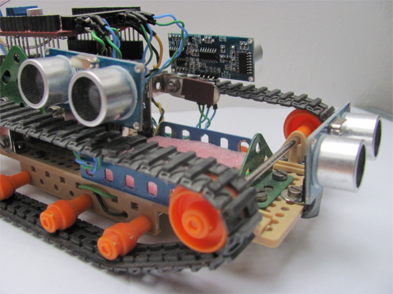
    
    Upevnění senzorů na APV

Jak jsem již zmiňoval, na kovové konstrukci nad převodovkou je umístěno Arduino Leonardo do Arduina je zasunuta deska Ardumoto a do ní ještě LCD display. Problém je, jak vyvést signály a napájení z senzorům. Výstupy Arduina nejsou vyvedeny z LCD desky. Dalo by se říci, že je to koncový stupeň. K vývodu výstupů jsem musel využít část universálního pájivého pole, které je umístěno na desce Ardumoto. Na okraj tohoto pole jsem zapájel úhlovou dutinkovou lištu 16x2. Pomocí vodičů jsem na tuto lištu vyvedl několik napájení a zemí a potřebné výstupy. 

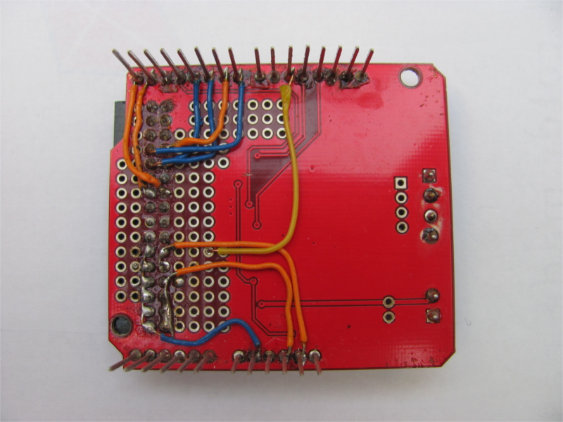
    
    Propojení úhlové patice

Legenda k úhlové liště s umístěním a typem výstupu je zobrazena na :num:`obr. #obr-piny`. V legendě jsou uvedeny všechny výstupy Arduina Leonarda, ale zapojeny jsou jen potřebné. Zapojeno je napájení a z digitálních 0 a 1 a potom 4-7. Zbylé piny nevyužívám, a proto nejsou zapojeny.

..  _obr-piny:

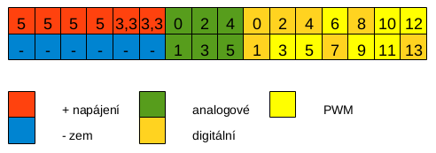
    
    Legenda k zapojení úhlové patice

Každý ze tří senzorů je připojen pomocí modrých a zelených vodičů zapojených do úhlové patice (viz :num:`obr. #obr-kabely`). Všechny dráty jsou pečlivě zapleteny do plastovokovové konstrukce. Zapletení drátu má více důvodů. Prvně z důvodu bezpečnosti, protože kdyby pásové vozidlo jelo přes drsnější terén, mohly by se volně visící kabely o tento terén zachytit. Za druhé z důvodu estetiky a za třetí z důvodu úspory místa. V poslední řadě je zapotřebí vyřešit napájení motorů. Toto je vyřešeno pomocí plochého čtyřvodičového kabelu připojeného do svorek na Ardumoto desce.

..  _obr-kabely:

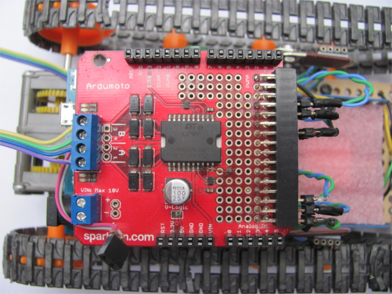
    
    Připojení kabeláže

Nakonec je potřeba vyřešit na hardwarové stránce komunikaci Arduina, Ardumoto desky a |_| LCD desky. Obvody na LCD desce komunikují s Arduinem přes digitální výstupy 2 a 3. Ardumoto deska taky používá výstup 3 a to na řízení rychlosti motoru A pomocí PWM. Přes jeden výstup se nemůže provádět dvojí komunikace. Proto jsem přerušil zalamovacím nožem na Ardumoto desce vyleptanou cestu vedoucí k výstupu 3 a přepojil jsem ji na výstup 10, který ho dokáže plně nahradit (viz :num:`obr. #obr-propoj`).

..  _obr-propoj:

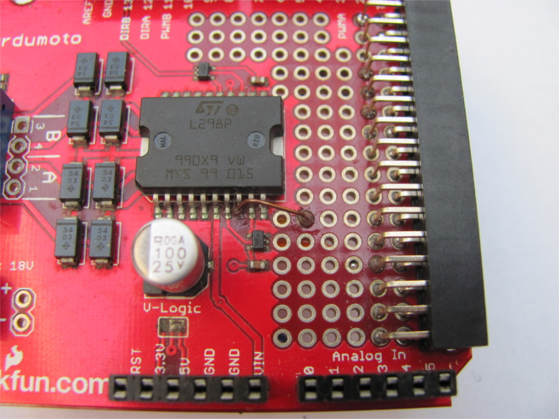
    
    Přepojení PWMA na PWM 10

Tím je uvolněna komunikace displaye i Ardumoto desky. Display komunikuje pomocí výstupů 2 a 3, ale pouze s Arduinem UNO, ale s Arduinem Leonardo komunikuje za pomoci krajních výstupů SDA a SCL. Ardumoto je primárně děláno na Arduino Uno, kvůli tomu nemá na sobě tyto výstupy vyvedeny. Proto jsem musel vyrobit propojku z ploché dvoulinky propojující na přímo výstupy SDA a SCL na  Arduinu s LCD deskou. Díky tomu nyní dokáží obě desky nezávisle na sobě komunikovat s Arduinem. Celá sestava je zobrazena na :num:`obr. #obr-komplet`. Sestava je umístěna na plošině nad převodovkou.

..  _obr-komplet:

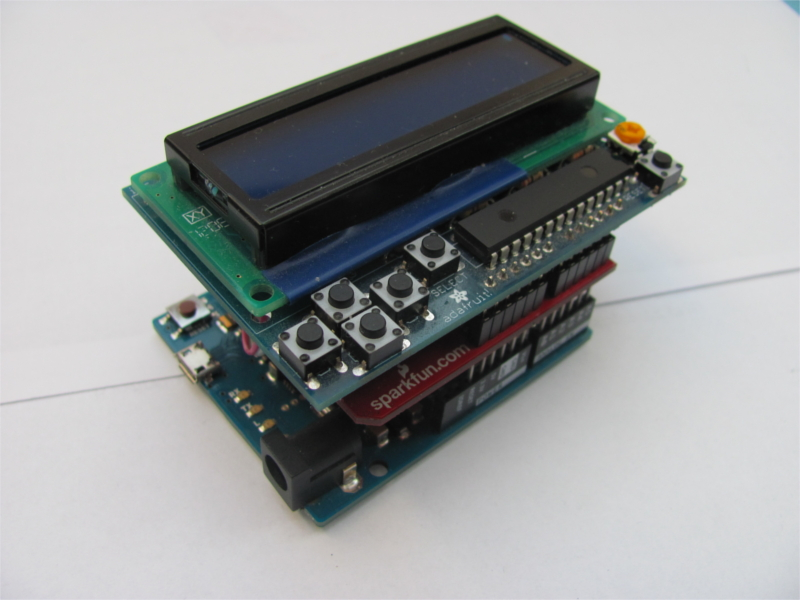
    
    Kompletní sestava řídící jednotky

Máme kompletní a funkční řídící jednotku. Zapojení senzorů motorů a napájení je znázorněno na blokovém schématu na obrázku 4.10. Senzory HC-SR04 jsou popsány viz kap. :ref:`kap-senzor`. Pravý senzor má Trigger [#p3]_ připojený na digitální výstup 4 a Echo [#p4]_ na 0. Přední senzor má Trigger připojený na 5 a Echo na výstup 1. Levý senzor má Trigger připojen na 6 a Echo na 7. Výstup Echo každého senzoru musí být připojeno na digitální výstupy s přerušením. Kompletní schéma vytvořené v programu Fritzing [#p6]_ je zobrazeno viz :num:`obr. #obr-fritz`. 

..  _obr-fritz:

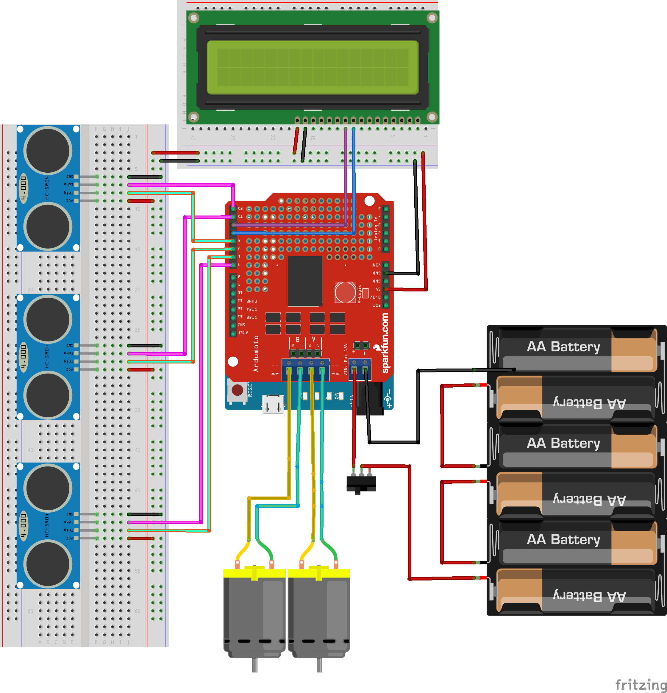
    
    Blokové schéma zapojení

Celé pásové vozidlo jehož konstrukci a zapojení jsem nyní popsal je zobrazeno viz :num:`obr. #obr-tank`. Pásové vozidlo má rozměry šxdxv 10,5x20x10 [cm] a hmotnost přesně 600 |_| g i s šesti akumulátory.

..  _obr-tank:

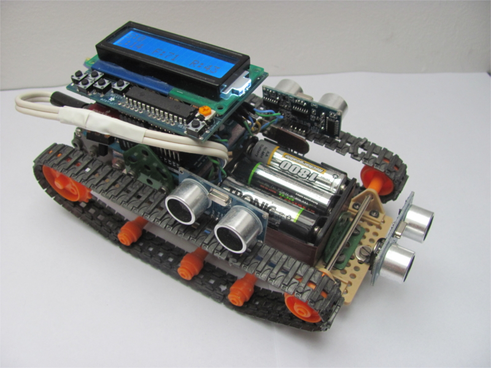
    
    Kompletní konstrukce Autonomního vozidla

V poslední části této podkapitoly se budu věnovat bludišti. Bludiště by mělo být pevné, ale zároveň pružné, aby při náhlém nárazu se vozidlo nepoškodilo. Mělo by být skladné a přenosné. Z těchto důvodu jsem si jako materiál pro výrobu bludiště vybral fitness puzzle koberec, který je pružný a snadno sestavitelný. Fitness koberec se skládá ze středových čtvercových dílů o |_| rozměrech 30x30 [cm] a |_| z |_| okrajových dílů ve tvaru obdelníků o rozměrech 8x30 [cm]. Tím je stanovena i má šířka bludiště (30 |_| cm) a také délka bludiště, která činí cca 270 |_| cm. Bludiště se skládá za dvou levotočivých a |_| ze dvou pravotočivých zatáček a |_| tří rovinek (viz :num:`obr. #obr-bludiste`).

..  _obr-bludiste:

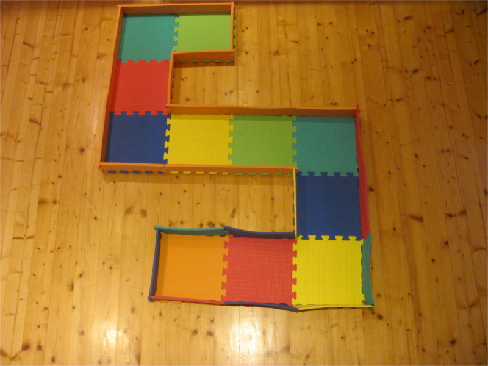
    
    Bludiště

..  [#p2]  Stejnosměrný proud
..  [#p3]  Vstup
..  [#p4]  Výstup
..  [#p6]  Open source program pro vytváření návrhů obvodů a DPS
