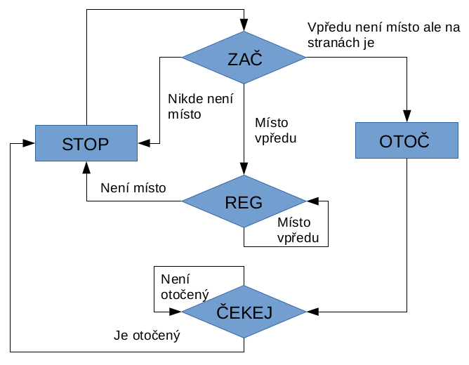

..  _kap-program:

*******************
Program
*******************

.. |_| unicode:: 0xA0
   :trim:

Úkolem programu je získat hodnoty ze senzorů na základě těchto hodnot vyhodnotit situaci v |_| jaké se vozidlo nachází a podle toho jednat. Celý kód je napsaný jazykem Wiring v Arduino IDE. Arduino IDE i Wiring jsou popsány viz kap. :ref:`kap-sw`. V této kapitole jsou popsány jednotlivé části kódu a jejich význam a funkce.

Na ovládání LCD desky jsou potřeba dvě knihovny. Jedna je na ovládání samotného LCD displaye a druhá na odvládání obvodu, skrze který můžeme ovládat LCD display pouze pomocí I2C sběrnice. Také je potřeba knihovna na řízení časovače 3 využívaného na měření vzdálenosti skrze ultrazvukové senzory.

..  code-block:: cpp

    #include <Wire.h>
    #include <Adafruit_MCP23017.h>       // Knihovna na ovladani obvodu na LCD
    #include <Adafruit_RGBLCDShield.h>   // Knihovna na ovladani LCD displaye
    #include <TimerThree.h>              // Knihovna na ovladani casovace 3

Ve svém kódu hodně využívám definice. Zpřehledňují kód a činí ho čitelnějším a zlepšují orientaci v něm. Využívám je ve `switch()` [#p1]_ na pojmenování stavů.

..  code-block:: cpp

    #define STATE_BEG 0                   // Stav pocatek
    #define STATE_FORW 1                  // Stav jed dopredu
    #define STATE_REG 2                   // Stav reguluj
    #define STATE_TURN_RIGHT 3            // Stav zatoc doprava
    #define STATE_TURN_LEFT 4             // Stav zatoc doleva
    #define STATE_STOP 5                  // Stav stuj
    #define STATE_OTOC 6                  // Stav otoc
    #define STATE_TURN_AROUND 7           // Stav otoc se na druhou stranu
    #define STATE_ROV 8                   // Stav rovne
    #define STATE_WAIT 9                  // Stav cekej

Ve funkci `setup()` nastavuji vstupy a výstupy senzorů, nastavuji přerušení, časovač, display a |_| nastavuji jednotlivé úlohy plánovače.

..  code-block:: cpp

    void setup() 
    {
      pinMode(trigPin_L, OUTPUT);         
      pinMode(echoPin_L, INPUT);          
      // Nastaveni vstupu a vystupu u leveho ultrazvukoveho senzoru

      Timer3.attachInterrupt( timerIsr );
      // Nastaveni preruseni od casovace 3 

      attachInterrupt(echo_int_L, echo_interrupt_L, CHANGE);
      // Nastaveni preruseni od leveho senzoru, ktere bude reagovat na zmenu

      lcd.begin(16, 2);                   // Nastaveni displaye                  

      pinMode(pwm_a, OUTPUT);             // Rychlost motoru A
      pinMode(pwm_b, OUTPUT);             // Rychlost motoru B
      pinMode(dir_a, OUTPUT);             // Smer motoru A
      pinMode(dir_b, OUTPUT);             // Smer motoru B

      digitalWrite(dir_a, HIGH);          // Primarni smer dopredu
      digitalWrite(dir_b, HIGH);          // Primarni smer dopredu

      //--------------------------------------------//
      // Ukázka struktury úlohy měření pro plánovač //
      //--------------------------------------------//

      stTasks[TASK_MER].iTaskID = TASK_MER;
      stTasks[TASK_MER].lPeriod = 300;    // Perioda opakovani
      stTasks[TASK_MER].lNextRun = 50;    // Dalsi spusteni
      stTasks[TASK_MER].lDuration = 0;    // Doba trvani
      stTasks[TASK_MER].bType = TYPE_CYCLIC;       // Typ
      stTasks[TASK_MER].bState = STATE_RUNNING;    // Stav
      stTasks[TASK_MER].fnCallBack = &fnTask_MER;
    }

Ve funkci `loop()` se volá jediná funkce a to funkce plánovač, která je nadřazená ostatním funkcím.

Funkce plánovač `fnSheduler()` je funkcí kooperativního multitaskingu (viz :ref:`kap-sw`). Při řízení APV je vyžadováno využití některého z multitaskingů, kvůli potřebě vykonávání několika úloh (procesů) naráz. Nepřetržitě musíme měřit vzdálenosti, tyto vzdálenosti musíme vyhodnotit a zobrazit a dát impulz motorům. To vše je nutno provézt v co nejkratším čase a nezávisle na sobě. Preemptivní multitasking nepřicházel v úvahu kvůli nevyhovujícímu hw. Plánovač prochází seznam úloh a na základě plánovaného času spouštění vybere úlohu, která se má spustit a provede její spuštění.

..  code-block:: cpp

    void fnScheduler()
    {
      unsigned long lNow = millis();
      // Zjisteni aktualniho casu
      unsigned long lTmp; 
      for(int i=0; i<TASKS_NUM; i++) {
      // Postupne zkontroluje vsechny ulohy  
        if(stTasks[i].bState == STATE_RUNNING) {
        // Kdyz je uloha spustena, pokracuje
          if(stTasks[i].lNextRun <= lNow) {
          // Kdyz cas dalsiho spusteni se shoduje, pokracuje
            stTasks[i].lLastRun = lNow;
            // Do posledniho spusteni priradi aktualni cas 
            lTmp = micros();
            // Do promenne priradi aktualni cas
            stTasks[i].fnCallBack(stTasks[i].iTaskID);
            stTasks[i].lDuration = micros()-lTmp;
            if(stTasks[i].bType == TYPE_CYCLIC) {  
            // Kdyz je uloha cyklicka, pokracuje  
              stTasks[i].lNextRun += stTasks[i].lPeriod;
              // K dobe dalsiho spusteni pricte periodu
            }
            else {
              stTasks[i].bState = STATE_SLEEPING;
              // Jinak ulohu uspi
            }
          }
        }
      }
    }

U úloh, které se spouštějí pouze jednou, provede plánovač jejich uspání. U APV je vždy nejdůležitější, aby mělo vždy dostatek dat podle kterých se může rozhodovat. Tyto data, neboli hodnoty získává ze tří ultrazvukových senzorů (viz. :ref:`kap-konstrukce`). Každý výstup Echo je připojen na přerušení, které reaguje na změnu.

..  code-block:: cpp

    void echo_interrupt_L()               // Funkce obsluhující int L senzoru                     
    {
      switch (digitalRead(echoPin_L))     // Kontrola log1 nebo log0
      {
      case HIGH:                          // Pro log1
        echo_end_L = 0;                   // nastaví na 0
        echo_start_L = micros();          // předá čas od spuštění
        break;

      case LOW:                           // Pro log0
        echo_end_L = micros();            // nastaví čas od spuštění
        echo_duration_L = echo_end_L - echo_start_L;
        // celková doba získaná odečtením začátku od konce
        break;
      }
    }

Arduino po spuštění, nebo restartu automaticky počítá jak dlouho je spuštěné. Díky tomu se za pomoci funkce `micros()` [#p2]_  dá jednoduše zjistit, jak dlouho trvala cesta ultrazvuku od vysílače k |_| příjmači. A následně vypočítat podle vzorce výslednou vzdálenost (viz :ref:`kap-senzor`).

..  code-block:: cpp

    void GetSensorValues()                // Funkce pro výpočet vzdálenosti   
    {
      noInterrupts();                     // Zakázání přerušení
      lL = echo_duration_L;               // Doba cesty ultrazvuku
      interrupts();                       // Povolení přerušení
      lL = lL/58;                         // Výpočet vzdálenosti pro L sen.
    }

Naměřené vzdálenosti se zobrazují na LCD display. Zobrazování se provádí ve funkci `zobraz()`. Díky knihovnám je ovládání display velmi jednoduché. Funkcí `lcd.setCursor(,)` nastavíte pozici kurzoru a funkcí `lcd.print()` zobrazíte.

..  code-block:: cpp

    void zobraz()
    {
      lcd.setCursor(0, 0);                // Nastavení kurzoru 
      lcd.print("S:");                    // Zobrazení S:
      lcd.print(state_dis);               // Zobrazení aktuálního stavu dis.
      lcd.setCursor(0, 1);                // Nastavení kurzoru
      lcd.print("L:");                    // Zobrazení L:
      getCharNum(lL, sL);                 // Převedení na řetězec
      lcd.print(sL);                      // Zobrazení vzdálenosti L sen
    }

Duležitou část tvoří úloha regulátoru rovné jízdy. Popis a funkce regulátoru je popsána v kap. :ref:`kap-regulace`. Následuje krátká ukázka regulátoru.

..  code-block:: cpp
    
    iErr1 = L_SET - lL;                   // Rozdíl vzdálenosti vlevo
    iErr2 = fnUhel(pole_l);               // Úhel natočení
    if(iErr1 < 0) {                       // Když je moc daleko 
      speed_motor_l = NORMAL_SPEED_L + iErr1 * K;   
      // Zpomal levy -> zatoc doleva
      speed_motor_r = NORMAL_SPEED_R;
      // Pravý normální rychlostí
    }
    else if (iErr1 > 0) {                 // Když je moc blizko
      speed_motor_l = NORMAL_SPEED_L;     // Levý normální rychlostí
      speed_motor_r = NORMAL_SPEED_R - iErr1 * K;   
      // zpomal pravy -> zatoc doprava
    }

K rovné jízdě je potřeba znát odchylku od správné vzdálenosti a úhel natočení vůči stěně.

Nejdůležitější částí celého programu je `Dispečer`, který je realizovaný pomocí příkazu `switch()`. V hlavním stavu dispečera (`STATE_BEG`) se rozhoduje na základě hodnot získaných ze senzorů o dalším pohybu APV.

..  code-block:: cpp

    switch(state_dis)
    {
    case STATE_BEG:
      if(lF>MIN_DELKA_F) {
        state_dis = STATE_FORW;
      }
      else{
        if(lR>MIN_DELKA_S)
          state_dis = STATE_TURN_RIGHT;      
        if(lL>MIN_DELKA_S)
          state_dis = STATE_TURN_LEFT;
        if(lR<=MIN_DELKA_S && lL<=MIN_DELKA_S)
          state_dis = STATE_STOP;
      }    
      break;

Kompletní `Dispečer` se všemi stavy je vidět na :num:`obr. #obr-dispecer`. V hlavním bloku (`ZAČ`) se rozhoduje, jaká operace se bude provádět. Ukázka je k vidění výše. Po vyhodnocení situace pojede APV buď dopředu, nebo začne zatáčet, nebo bude stát na místě.

..  _obr-dispecer: 

    
    Vývojový diagram dispečer

..  [#p1]  Přepínač
..  [#p2]  Funkce z knihovny Wiring
